# 🏗️ 1C AI Stack - Architecture Diagram

> ⚠️ **ВНИМАНИЕ:** Этот файл описывает состояние на **5 ноября 2025**.  
> **Актуальная версия:** [ARCHITECTURE_OVERVIEW.md](../../02-architecture/ARCHITECTURE_OVERVIEW.md) (обновлено 6 ноября 2025)  
> **Новые компоненты:** EDT-Parser, ML Dataset (24K+ примеров), Analysis tools, Audit suite

**Версия:** 5.0  
**Дата:** 2024-11-05  
**Статус:** Production Ready (99%)

---

## 🎯 High-Level Architecture

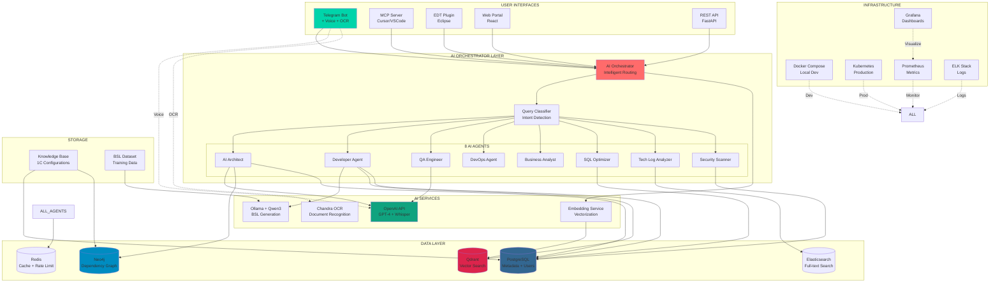

---

## 🔄 Data Flow Diagrams

### Voice Query Flow

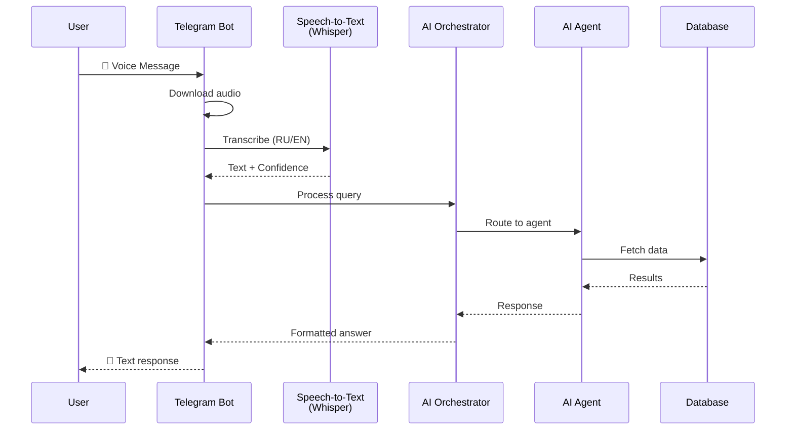

### OCR Document Flow

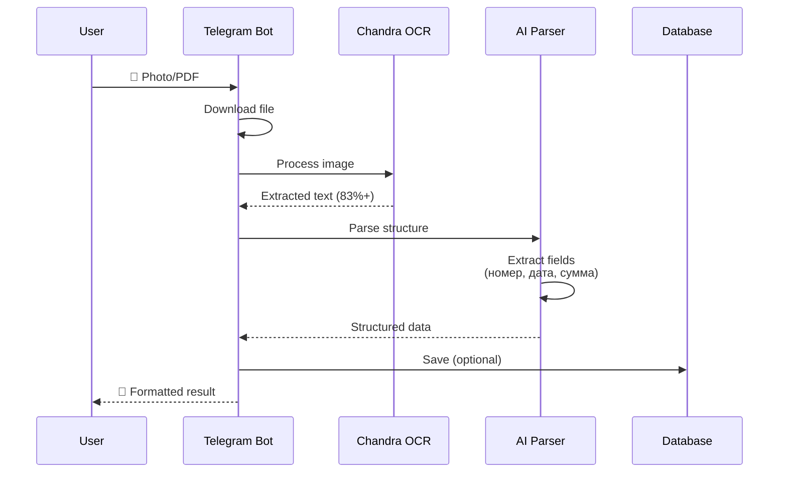

### Code Generation Flow

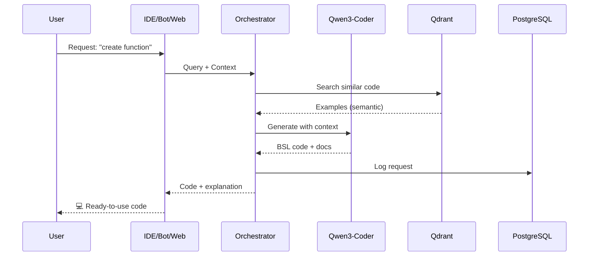

---

## 🌐 Component Architecture

### Level 0: User Interfaces

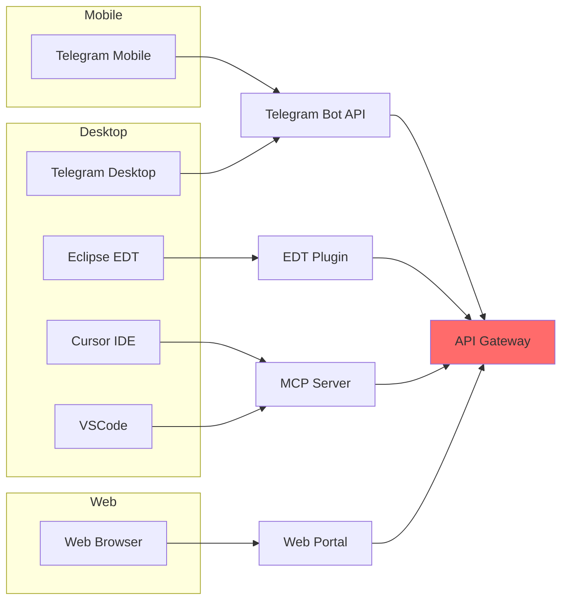

### Level 1: AI Services Integration

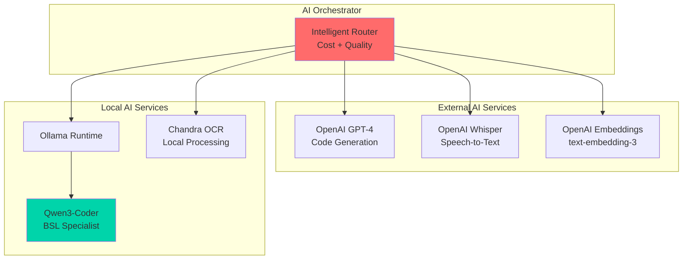

### Level 2: Data Storage

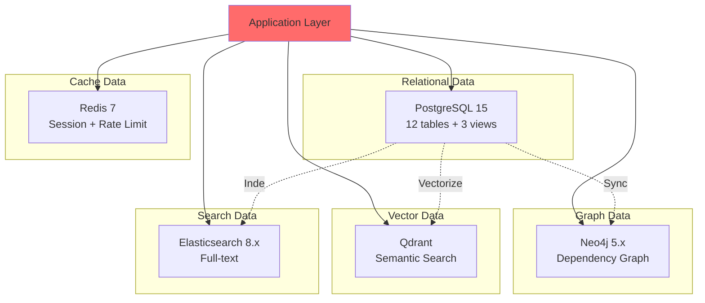

---

## 🔐 Security Architecture

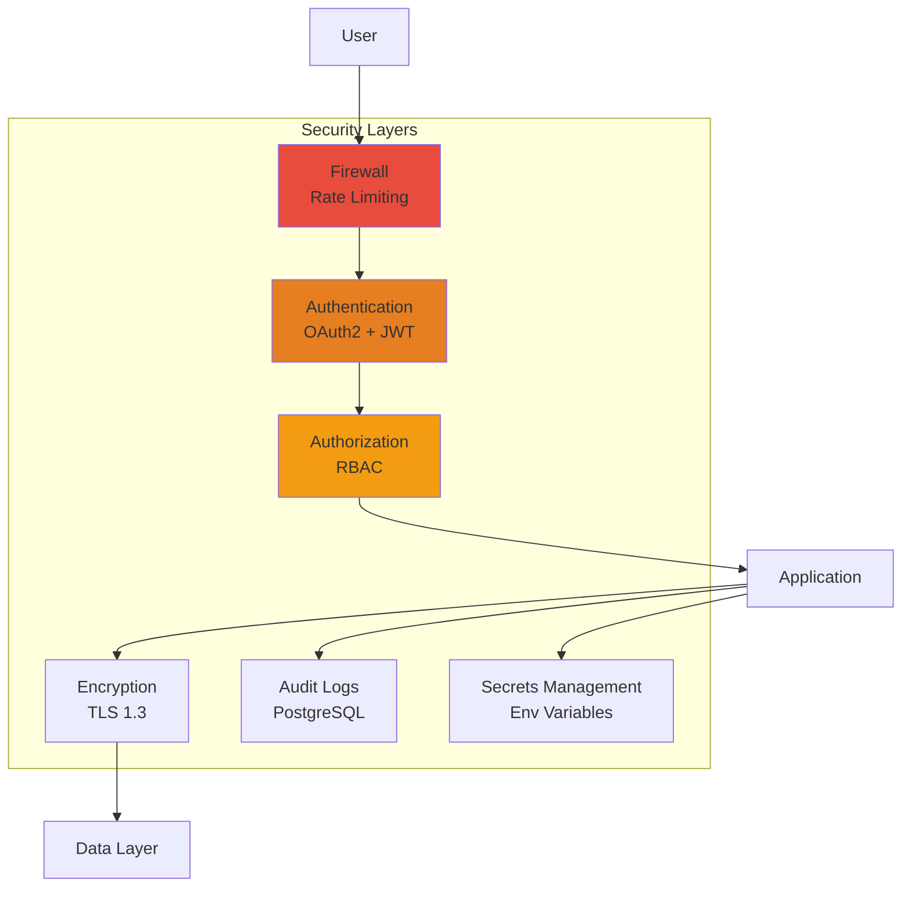

---

## 📊 Deployment Architecture

### Development

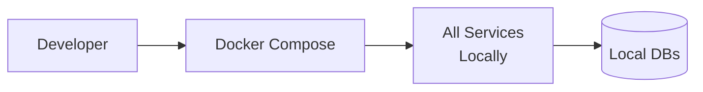

### Production (Kubernetes)

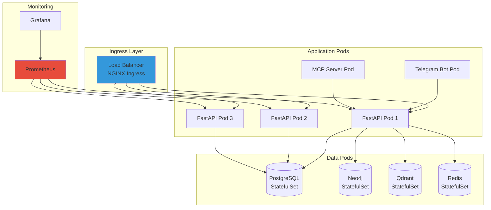

---

## 🎨 Technology Stack Visualization

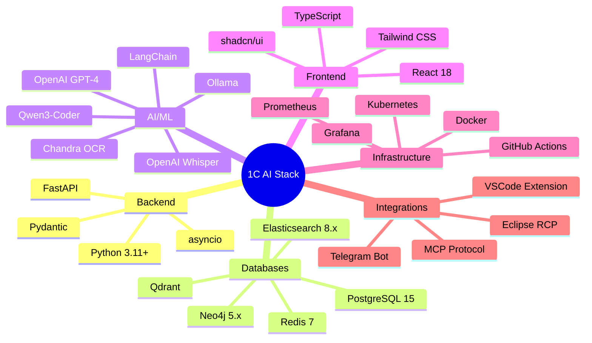

---

## 📈 Scalability Architecture

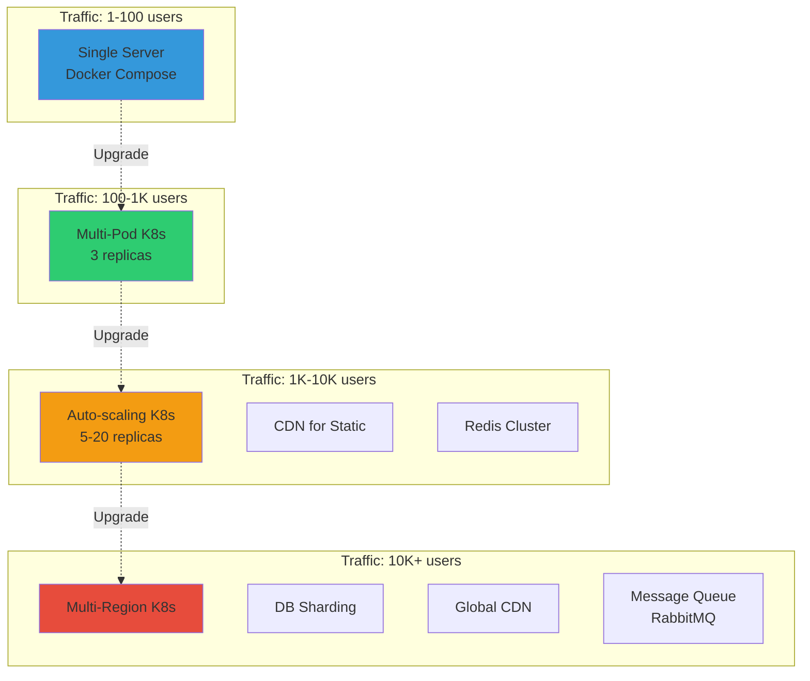

---

## 🔄 CI/CD Pipeline

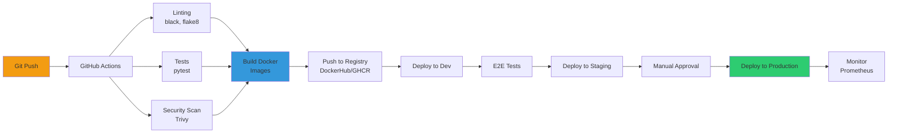

---

## 📝 Генерация PNG диаграммы

### Вариант 1: Mermaid CLI

```bash
# Установить Mermaid CLI
npm install -g @mermaid-js/mermaid-cli

# Сгенерировать PNG из первой диаграммы
mmdc -i docs/architecture/ARCHITECTURE_DIAGRAM.md \
     -o Architecture_Connections_Diagram.png \
     -t dark \
     -b transparent \
     -w 2400
```

### Вариант 2: Online Mermaid Editor

1. Открыть https://mermaid.live/
2. Скопировать код из раздела "High-Level Architecture"
3. Экспортировать как PNG
4. Сохранить как `Architecture_Connections_Diagram.png`

### Вариант 3: VS Code Extension

1. Установить расширение "Markdown Preview Mermaid Support"
2. Открыть этот файл в VS Code
3. Preview → Export to PNG

---

## 🎯 Ключевые компоненты

### Реализовано (99%):

- ✅ Telegram Bot (Voice + OCR + i18n)
- ✅ MCP Server (Cursor/VSCode)
- ✅ AI Orchestrator (8 agents)
- ✅ PostgreSQL (12 tables)
- ✅ Neo4j (graph)
- ✅ Qdrant (vectors)
- ✅ Elasticsearch (search)
- ✅ Redis (cache)
- ✅ OpenAI integration
- ✅ Qwen3-Coder
- ✅ Chandra OCR
- ✅ Marketplace API
- ✅ BSL Dataset builder

### В разработке (1%):

- 🚧 EDT Plugin (95%)
- 🚧 Web Portal (UI polish)

---

**Версия диаграммы:** 5.0  
**Последнее обновление:** 2024-11-05  
**Статус:** ✅ Production Ready

