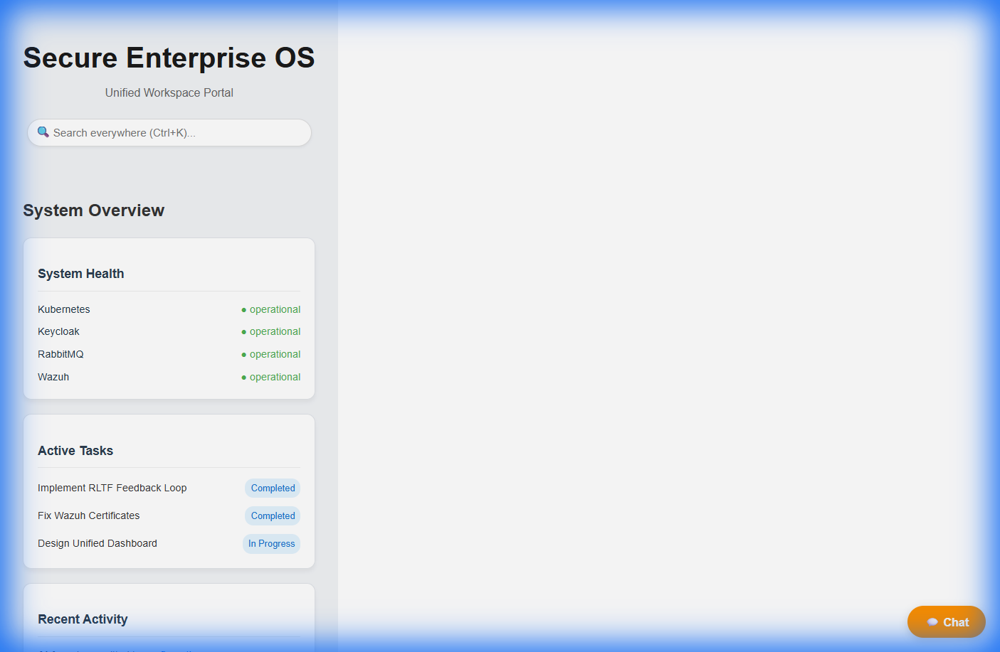
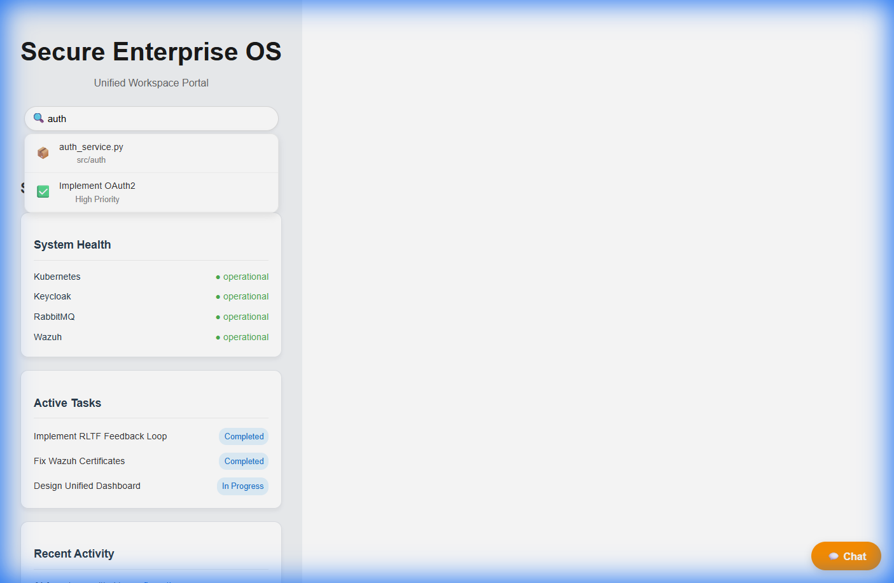

# Gateway Module

## Overview

The Gateway module serves as the single entry point for the 1C AI Ecosystem. It handles request routing, authentication, logging, and service health monitoring.

## Architecture

Refactored from a monolithic `gateway.py` into Clean Architecture:

- **Domain**: Configuration (`config.py`) and Pydantic models (`models.py`).
- **Services**:
  - `ServiceHealthChecker`: Monitors health of downstream microservices.
  - `ProxyService`: Handles request proxying with validation and error handling.
  - `Middleware`: Authentication (`auth.py`) and Request Logging (`logging.py`).
- **API**: FastAPI routes (`routes.py`) exposing health and proxy endpoints.

## Features

- **Unified Entry Point**: Single API for all microservices.
- **Authentication**: API key validation via `AuthenticationMiddleware`.
- **Observability**: Structured logging via `RequestLoggingMiddleware`.
- **Resilience**: Timeouts, error handling, and health checks.
- **Security**: Input sanitization and validation.

## Usage

The module is exposed via `src.modules.gateway.api.routes`.
Legacy imports from `src.api.gateway` are supported via a proxy file.

---

## 🚀 8. Unified Intelligence (v3.0)

**Мы совершили квантовый скачок. Платформа превратилась в Единую Интеллектуальную ОС.**
Больше никаких разрозненных инструментов. Только **Single Pane of Glass**.

### 1. 🚀 Unified Workspace (Единое Окно)
Мы объединили **VS Code**, **NocoBase**, **Portainer** и **Gitea** в один бесшовный портал.
Вы пишете код, управляете задачами и следите за серверами, не переключая вкладки.

### 2. 🧠 RLTF (Reinforcement Learning from Task Feedback)
Система перешла от "выполнения команд" к **самообучению**.
*   **Feedback Loop:** Каждое ваше действие (Save, Commit, Run) — это сигнал для обучения.
*   **Action Prediction:** ИИ предугадывает ваш следующий шаг (например, предлагает "Commit" после успешного теста).
*   **Context Awareness:** "Глаза" системы видят, что происходит в браузере в реальном времени.

### 3. 🔍 Global Search (Brain Index)
Мгновенный поиск по всему:
*   📦 **Код** (Git)
*   ✅ **Задачи** (NocoBase)
*   📄 **Документация** (Wiki)

**Итог:** Это больше не набор скриптов. Это **Secure Enterprise OS**, которая думает вместе с вами.
